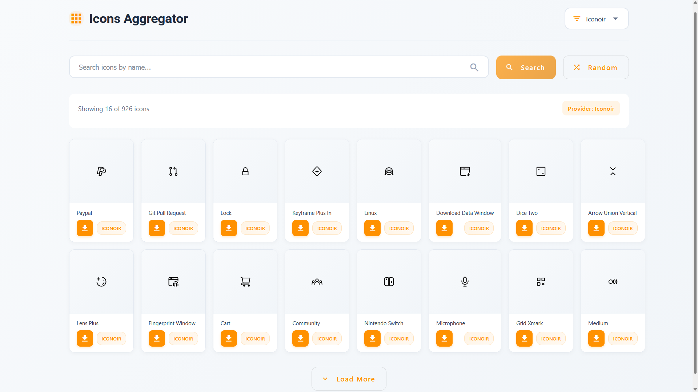
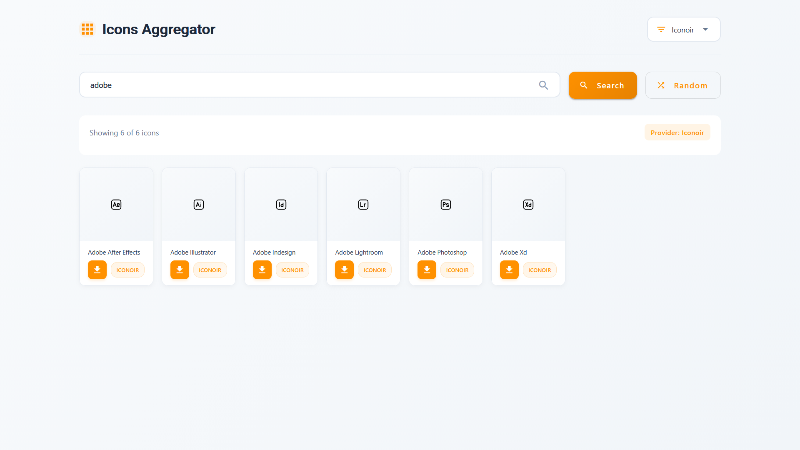

# Icons Aggregator 🎨⚡

A beautiful Angular application that aggregates SVG icons from multiple providers (Iconoir & Bootstrap) into a single, unified interface.  
Search, browse, and download high-quality icons with a clean, modern UI and extensible architecture.

## ✨ Features

- 🔍 **Smart Search** – Find icons across multiple providers instantly
- 🎲 **Random Discovery** – Get inspired with random icon selections
- 🔄 **Multi-Provider Support** – Switch between Iconoir & Bootstrap seamlessly
- ⬇️ **One-Click Downloads** – Download SVG icons with proper formatting
- 📱 **Fully Responsive** – Works perfectly on all devices
- 🎯 **Debounced Search** – Optimized performance with intelligent search
- 📦 **Pagination** – Load more icons as you scroll
- 🛡️ **Secure SVG Rendering** – Safe, sanitized SVG previews
- 🎨 **Modern UI** – Built with Angular Material & custom styling

## 🖼️ Screenshots

| Random Results | Search Results |
|-------------|----------------|
|  |  |

## 🏗️ Architecture Overview

```
src/
├── components/           🧩 Reusable UI Components
│   ├── icon-card/          → Icon display + download
│   ├── provider-selector/  → Provider switcher
│   └── loading-spinner/    → Animated loading states
│
├── core/                  🧠 Core Business Logic
│   ├── models/              → Data structures & interfaces
│   ├── services/            → Core services
│   │   ├── providers/       → Provider implementations
│   │   ├── download.service.ts           → Icon download logic
│   │   └── provider-registry.service.ts  → Provider management
│   └── interceptors/                     → HTTP interceptors
│
├── pages/               📄 Page Components
│   └── home/             → Main application page
│
└── environments/        ⚙️ Environment configuration
```

For a detailed breakdown of system design, architectural decisions, design patterns, and scalability considerations, see:

📘 **[Architecture Documentation](ARCHITECTURE.md)**

## 🔌 Provider System (Extensible Design)

Each provider implements a common interface:

```typescript
interface IconProvider {
  readonly name: string;
  readonly displayName: string;
  
  search(query: string, limit: number, offset: number): Observable<IconApiResponse>;
  getRandom(limit: number, offset: number): Observable<IconApiResponse>;
}
```

The **Provider Registry Service** handles:
- 📝 Provider registration & management
- 🔄 Active provider switching
- 🎯 Unified API for all providers

**Easy to add new providers** (Material Icons, Font Awesome, etc.) without changing UI logic!

## 🚀 Getting Started

### Prerequisites
- Node.js (v16 or higher)
- npm or yarn
- Angular CLI (optional)

### Installation

```bash
# Clone the repository
git clone https://github.com/SharadJ19/GIF-Plugin-Standalone/
cd icons-aggregator

# Install dependencies
npm install

# Start development server
ng serve
```

Navigate to `http://localhost:4200` in your browser.

### Building for Production

```bash
# Build the project
ng build --configuration production

# The build artifacts will be stored in the dist/ directory
```

## 📖 How to Use

1. **Search Icons**: Type in the search box to find icons by name
2. **Random Icons**: Click "Random" to discover new icons
3. **Switch Providers**: Use the provider selector to switch between Iconoir & Bootstrap
4. **Download Icons**: Click the download button on any icon card
5. **Load More**: Scroll down and click "Load More" for additional icons

## 🛠️ Tech Stack

- **Angular 15+** – Modern web framework
- **TypeScript** – Type-safe development
- **RxJS** – Reactive programming
- **Angular Material** – UI component library
- **GitHub API** – Icon source integration
- **CSS3/SCSS** – Modern styling with custom animations

## 🔧 Configuration

### Environment Setup

1. Create a GitHub Personal Access Token (optional, for higher rate limits)
2. Configure in `src/environments/environment.ts`:

```typescript
export const environment = {
  production: false,
  githubToken: 'your_github_token_here', // Optional
  // ... other config
};
```

### Adding a New Icon Provider

1. Create a new provider service extending `BaseProviderService`
2. Implement the required methods
3. Register in `AppComponent`:

```typescript
this.providerRegistry.registerProvider(
  'NEW_PROVIDER',
  'New Provider',
  this.newProviderService
);
```

## 📱 Responsive Design

- **Mobile** (≤767px): 2-3 columns
- **Tablet** (768px-1023px): 4-6 columns  
- **Desktop** (≥1024px): 6-8 columns

## 🎨 Design Features

- **Orange Accent Theme** (#FF9100) – Consistent color scheme
- **Smooth Animations** – Hover effects & transitions
- **Glassmorphism Elements** – Modern UI components
- **Custom Scrollbars** – Themed scrolling experience
- **Accessible** – Keyboard navigation & ARIA labels

## 🤝 Contributing

1. Fork the repository
2. Create a feature branch (`git checkout -b feature/AmazingFeature`)
3. Commit your changes (`git commit -m 'Add AmazingFeature'`)
4. Push to the branch (`git push origin feature/AmazingFeature`)
5. Open a Pull Request


## 👨‍💻 Author

**Sharad Chandel**  
R&D Intern  
*(Project shared with mentor for review & feedback)*

## 🙏 Acknowledgments

- [Iconoir](https://iconoir.com/) – For the beautiful icon set
- [Bootstrap Icons](https://icons.getbootstrap.com/) – For the comprehensive icon library
- [Angular Team](https://angular.io/) – For the amazing framework
- [GitHub](https://github.com) – For API access & hosting


⭐ **Star this repo if you find it useful!** ⭐